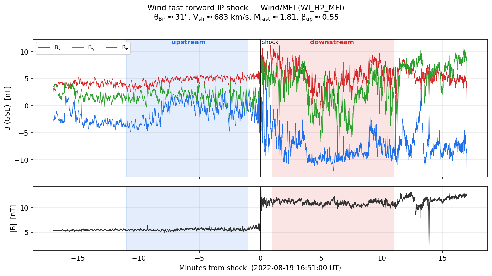
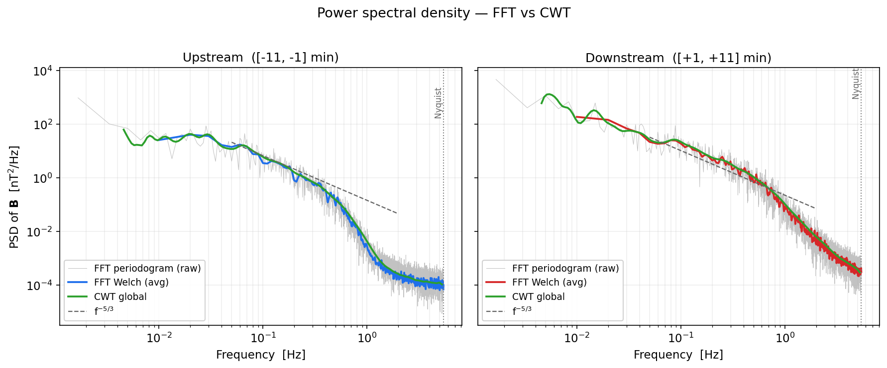
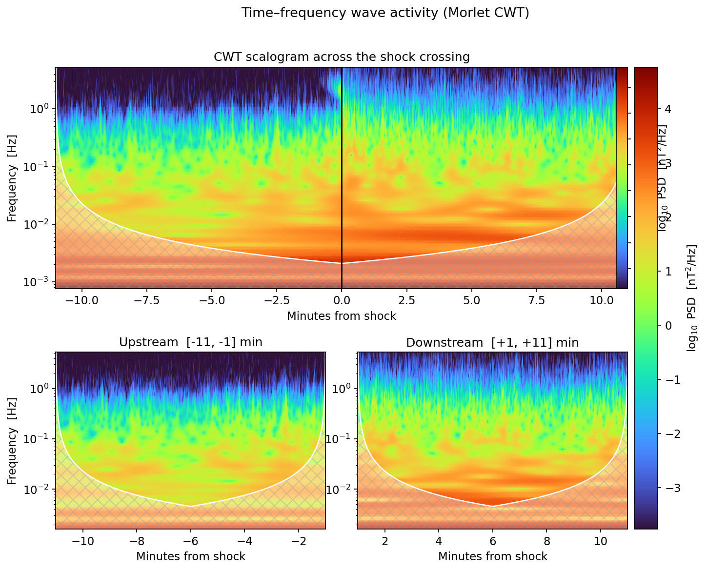
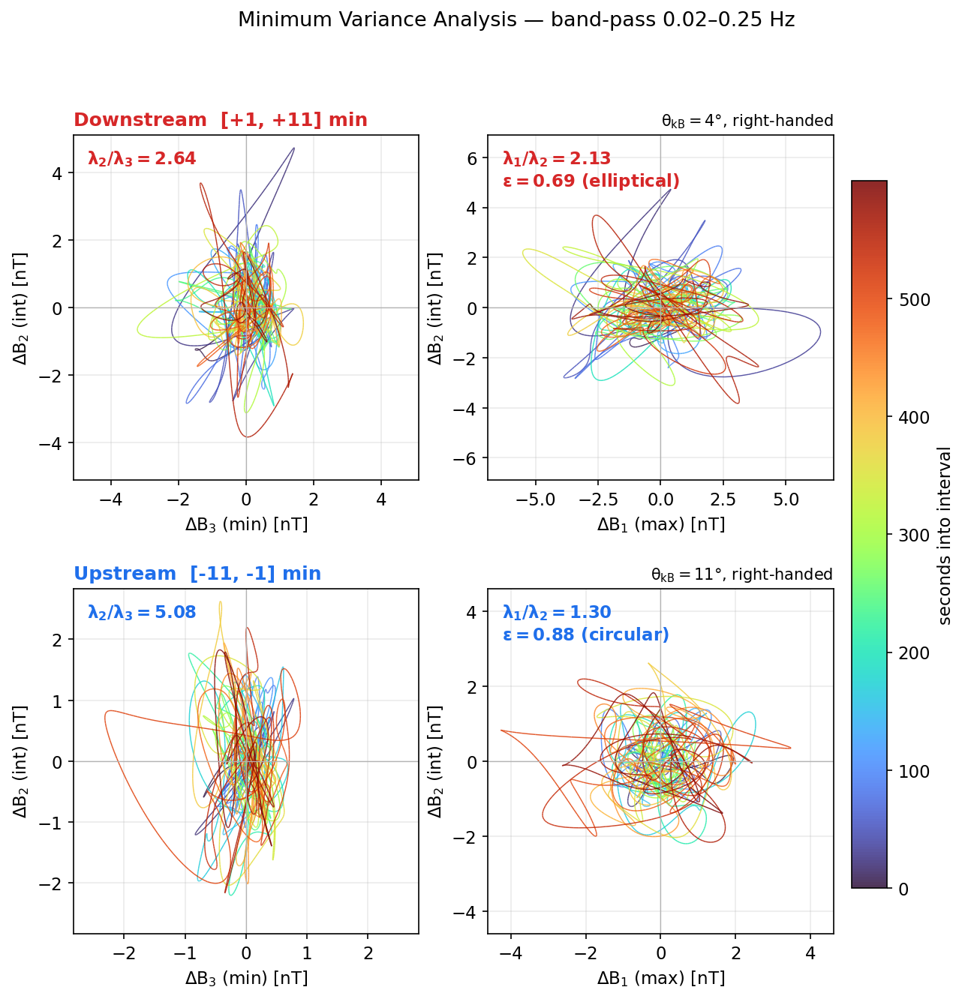
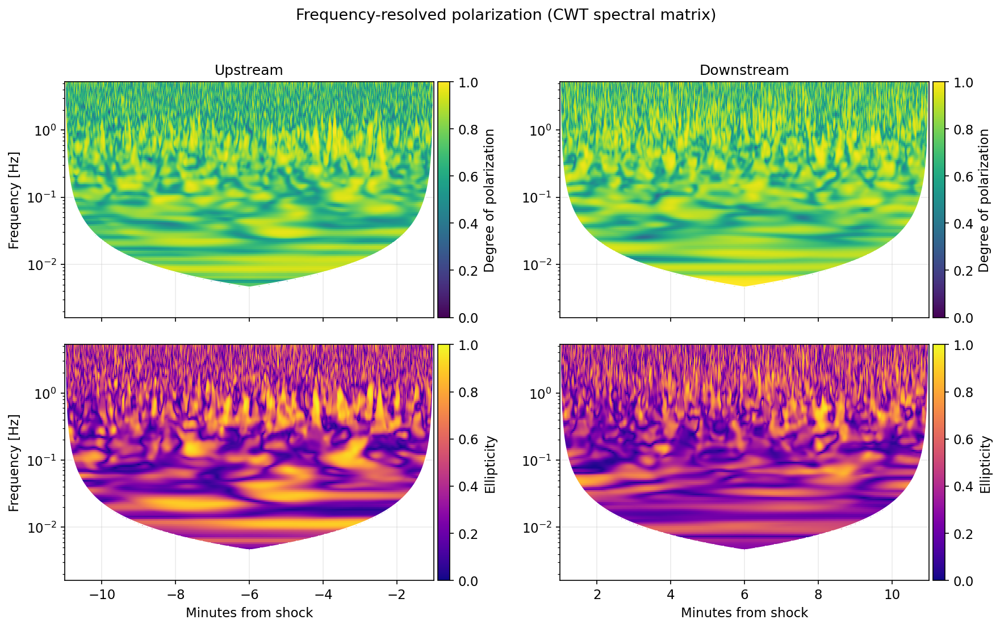

<div align="center">

# 🌌 Análisis Espectral de un Choque Interplanetario
### Spectral Analysis of an Interplanetary Shock

**FFT · Transformada Wavelet Continua · Análisis de Varianza Mínima**
de datos de campo magnético de alta resolución de *Wind*/MFI a través de un choque rápido directo.

<br>

[](https://www.python.org/)
[](https://numpy.org/)
[](https://scipy.org/)
[](https://matplotlib.org/)
[](https://opensource.org/license/mit)

[](https://cdaweb.gsfc.nasa.gov/)
[](https://lweb.cfa.harvard.edu/shocks/wi_data/00802/wi_00802.html)
[](docs/theory_es.md)
[](tests/test_analysis.py)
[](scripts/run_analysis.py)
[](https://www.geofisica.unam.mx/)

<br>



<sub>Campo magnético de NASA *Wind*/MFI a través de un choque interplanetario rápido directo —
**corriente arriba** tranquila y llena de ondas (azul) vs. **corriente abajo** comprimida y turbulenta (rojo).</sub>

**🌐 Español (este archivo)  ·  [English](README.en.md)**

</div>

---

## Resumen

Este repositorio resuelve la tarea del curso de la UNAM *Space Science and Data
Analysis — 3. Análisis Espectral* (Dr. Byeongseon Park, Instituto de Geofísica,
UNAM). Para un choque interplanetario real:

1. elige un **evento de choque** y define los intervalos **corriente arriba**
   (*upstream*) `[-11, -1] min` y **corriente abajo** (*downstream*)
   `[+1, +11] min`;
2. calcula la **densidad espectral de potencia (DEP)** del campo magnético con la
   **FFT** (periodograma + Welch) y con una **transformada wavelet continua (CWT)
   de Morlet**;
3. genera los mapas **2-D tiempo–frecuencia** de actividad de ondas
   (escalogramas CWT);
4. analiza la **polarización de las ondas** de cada intervalo con el **análisis
   de varianza mínima (MVA)** y una matriz espectral resuelta en frecuencia.

> 📄 Fundamento científico completo: [`docs/theory_es.md`](docs/theory_es.md) ·
> tarea: [`docs/space_science_data_analysis_3.pdf`](docs/space_science_data_analysis_3.pdf)

## El evento

Un choque interplanetario **rápido directo (FF)** observado por **Wind** en el
punto de Lagrange L1, tomado de la [Base de Datos de Choques Interplanetarios del
CfA (#00802)](https://lweb.cfa.harvard.edu/shocks/wi_data/00802/wi_00802.html).

| Cantidad | Valor | Significado |
|---|---|---|
| Tiempo `t₀` | **2022-08-19 16:51:00 UT** | llegada del choque a Wind |
| Tipo | **FF** | rápido directo (B y n aumentan) |
| `θ_Bn` | **31.3° ± 11.6°** | geometría **casi-paralela** |
| `V_choque` | 683 km/s | velocidad del choque |
| `M_rápido` | 1.81 | número de Mach magnetosónico rápido |
| `β_up` | 0.55 | beta del plasma corriente arriba |
| `r = B_d/B_u` | ≈ 2.4 (CfA) / ≈ 2.0 (obs.) | compresión magnética |
| Conjunto | `WI_H2_MFI` (`BGSE`) | campo de alta res., **fs ≈ 10.87 Hz** (≈ 39 000 pts/h) |

Los datos se descargan al vuelo de **NASA/GSFC CDAWeb** (un CDF recortado), se
leen con `cdflib` y se cachean como `.npz` comprimido para que cada figura
**se reproduzca sin conexión**.

## Métodos en un párrafo

La **DEP por FFT** usa la convención de un solo lado
$S(f) = 2\,\delta t/N\,|\tilde{B}(f)|^2$ en nT²/Hz, normalizada para que
$\int S\,df = \mathrm{var}(B)$ (verificado en **1.000**). La **CWT** sigue a
*Torrence & Compo (1998)*: wavelet Morlet compleja
$\psi_0(\eta)=\pi^{-1/4}e^{i\omega_0\eta}e^{-\eta^2/2}$ ($\omega_0=6$), escalas
diádicas $s_j=s_0\,2^{j\,\delta j}$, cono de influencia $\tau_s=\sqrt{2}\,s$ y la
DEP tiempo–frecuencia $S(f,t)=2\,\delta t\,\mathrm{Tr}\{S_{ij}\}$ con
$S_{ij}=W_i W_j^{\ast}$. El **MVA** diagonaliza la matriz de varianza
$M_{ij}=\langle B_iB_j\rangle-\langle B_i\rangle\langle B_j\rangle$; las razones de
valores propios $\lambda_1/\lambda_2$ (lineal↔circular) y
$\lambda_2/\lambda_3$ (calidad de la normal) clasifican la polarización.

## Resultados

### 1 · Densidad espectral de potencia — FFT vs CWT



La FFT promediada con Welch (color) y el espectro wavelet global (verde)
**coinciden**, pero la **CWT es claramente más suave** — el punto clave de la
clase. El espectro **corriente abajo** porta ~4× más potencia y muestra una
cascada turbulenta desarrollada cercana a la referencia de Kolmogórov
**$f^{-5/3}$**; el espectro **corriente arriba** es más plano, con un hombro ULF de
antechoque cerca de 0.02–0.06 Hz.

### 2 · Actividad de ondas tiempo–frecuencia (escalogramas CWT)



La potencia salta abruptamente en el choque (`t = 0`). Corriente arriba se
concentra en bajas frecuencias (las ondas ULF de antechoque de ~30 s); corriente
abajo se vuelve de **banda ancha**, extendiéndose a frecuencias más altas (la
vaina turbulenta). El **cono de influencia** rayado marca las regiones afectadas
por el borde (no confiables).

### 3 · Análisis de varianza mínima (hodogramas)



Filtrado a la banda de ondas (0.02–0.25 Hz). **Corriente arriba** es casi
**circular** (`λ₁/λ₂ = 1.30`, plano bien definido `λ₂/λ₃ = 5.1`, propagándose
~a lo largo de **B**, θ_kB ≈ 11°) — la firma de las **ondas ULF de antechoque**
casi-paralelas. **Corriente abajo** es claramente **elíptica** (`λ₁/λ₂ = 2.13`)
y de mayor amplitud — turbulencia compresiva de la vaina. Esto reproduce el
ejemplo de la diapositiva 11 (arriba circular, abajo elíptica).

### 4 · Polarización resuelta en frecuencia *(extra, diapositiva 9)*



Grado de polarización y elipticidad a partir de la matriz espectral CWT
`S_ij(f,t)` (promediada en ~5 periodos de onda por escala), un complemento al MVA
resuelto en frecuencia.

### Números clave

| Intervalo | ventana | ⟨\|B\|⟩ | var | λ₁/λ₂ | λ₂/λ₃ | elipticidad | polarización | θ_kB |
|---|---|---|---|---|---|---|---|---|
| **Corriente arriba** | [−11,−1] min | 5.52 nT | 5.2 nT² | **1.30** | 5.08 | 0.88 | **circular** | 11° |
| **Corriente abajo** | [+1,+11] min | 10.99 nT | 20.1 nT² | **2.13** | 2.64 | 0.69 | **elíptica** | 4° |

<sub>Verificación de Parseval: FFT ∫S df / var = 1.000 · reconstrucción CWT / var
= 0.90 (sesgo esperado de Torrence–Compo).</sub>

## Inicio rápido

```bash
# 1. preparar el entorno
make setup                     # o: python -m venv .venv && .venv/bin/pip install -r requirements.txt

# 2. ejecutar todo el flujo (descarga + cachea datos, escribe figures/*.png)
make run                       # o: .venv/bin/python scripts/run_analysis.py

# ¿sin conexión? usa el respaldo sintético físico:
make synthetic

# correr las pruebas
make test
```

Para analizar otro choque, edita el objeto `EVENT` en
[`src/spectral_shock/config.py`](src/spectral_shock/config.py).

## Estructura del repositorio

```
.
├── README.md · README.en.md      # este archivo (ES) + versión en inglés
├── requirements.txt · Makefile · LICENSE
├── scripts/run_analysis.py       # flujo completo → figures/ + results.json
├── src/spectral_shock/
│   ├── config.py                 # evento, intervalos, parámetros
│   ├── data.py                   # descarga CDAWeb + cdflib + caché + respaldo
│   ├── spectral.py               # DEP FFT, CWT Morlet, COI, matriz espectral
│   ├── mva.py                    # análisis de varianza mínima
│   └── plotting.py               # todas las figuras
├── tests/test_analysis.py        # pruebas unitarias sin conexión
├── data/                         # caché .npz (incluida) + .cdf (ignorada)
├── figures/                      # PNGs generados + results.md
└── docs/                         # theory_en.md, theory_es.md, PDF de la tarea
```

---

<div align="center">

### 📚 Referencias · 🛰️ Datos

</div>

**Métodos:** Torrence & Compo (1998), *A Practical Guide to Wavelet Analysis*,
BAMS; Sonnerup & Scheible (1998) en Paschmann & Daly (eds.), *Analysis Methods
for Multi-Spacecraft Data*, ISSI SR-001; Khrabrov & Sonnerup (1998). Listas
completas en [`docs/theory_es.md`](docs/theory_es.md) /
[`docs/theory_en.md`](docs/theory_en.md).

**Datos:** campo magnético de NASA *Wind*/MFI (Lepping et al. 1995), conjunto
`WI_H2_MFI`, cortesía del equipo Wind MFI y de **NASA/GSFC SPDF
[CDAWeb](https://cdaweb.gsfc.nasa.gov/)**. Parámetros del choque de la
**[Base de Datos de Choques IP del CfA](https://lweb.cfa.harvard.edu/shocks/)**
(RH08, Koval & Szabo 2008). Por favor cita a estos proveedores al usar los datos.

**Licencia:** Código bajo la [Licencia MIT](LICENSE). Los datos de NASA/CfA son
públicos y no están cubiertos por esta licencia.

<div align="center">
<sub>Elaborado para el curso de la UNAM <i>Space Science and Data Analysis</i> · Autor: Alonso Cervantes Flores</sub>
</div>
